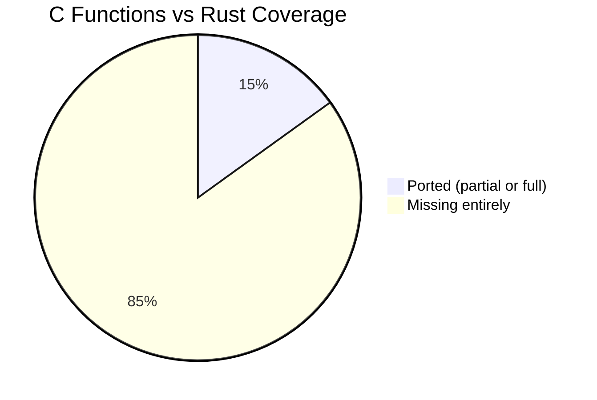
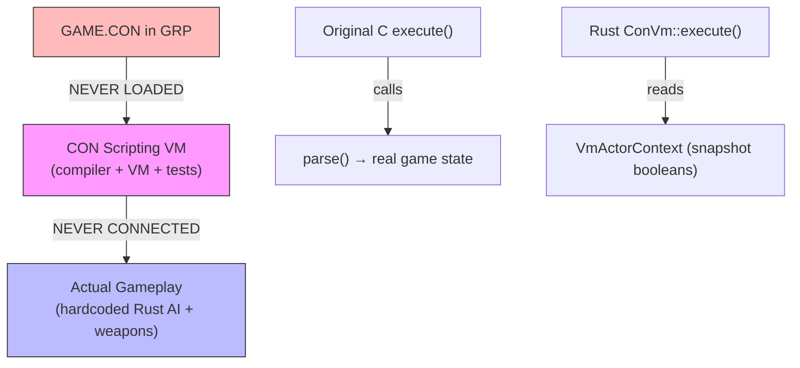

# Critical Assessment: Duke Nukem 3D → Rust Conversion
## With Full Comparative Analysis Against Original C Source

---

## Executive Summary

This is an **8,160-line Rust codebase** built over **~29 hours** (Aug 28–29, 2026) that reimplements portions of Duke Nukem 3D using **Bevy 0.14** and **Rapier 3D**. The original game comprises **~42,970 lines of game C** (in `source/`) plus **~31,620 lines of Build engine C** (in `SRC/`), totalling **~74,590 lines of C** (excluding headers, ASM, and libraries).

The Rust codebase covers approximately **11% of the original source by volume**, and the functional coverage is lower still. This is a **well-architected prototype** with genuinely good asset parsing and geometry generation, but it is **not a conversion** — it is a partial clean-room reimplementation that leaves the majority of game logic unported.

---

## 📊 Source Scale Comparison

| Original C File | Lines | Rust Equivalent | Lines | Coverage |
|---|---|---|---|---|
| `GAME.C` (game loop, HUD, UI) | 9,786 | `main.rs` + `hud/` + `game_flow/` | 1,125 | ~12% |
| `ACTORS.C` (actor movement/AI) | 7,136 | `combat/` (507 lines) | 507 | ~7% |
| `ENGINE.C` (Build renderer) | 8,829 | `builder.rs` + `map.rs` + `sky.rs` | 1,239 | N/A¹ |
| `PLAYER.C` (player mechanics) | 4,336 | `player/` | 718 | ~17% |
| `MENUES.C` (menu system) | 3,535 | `game_flow/menu.rs` | 85 | ~2% |
| `SECTOR.C` (sector effectors) | 3,223 | `interactivity/` | 893 | ~28% |
| `GAMEDEF.C` (CON VM) | 3,215 | `scripting/` | 2,097 | ~65% |
| `PREMAP.C` (level loading) | 1,563 | Part of `main.rs` | ~140 | ~9% |
| `SOUNDS.C` (sound system) | 672 | `audio/` | 191 | ~28% |
| **Total game C** | **42,967** | **Total Rust** | **8,160** | **~19%** |

¹ *ENGINE.C is the Build software renderer; Bevy replaces it entirely, so a line-count comparison is misleading. However, ENGINE.C also contains critical utility functions the game depends on.*

---

## 📁 File-by-File C → Rust Mapping

### Functions Ported vs Missing



| C Source File | Functions Defined | Ported to Rust | Missing |
|---|---|---|---|
| `GAMEDEF.C` | 21 | 14 | 7 |
| `SECTOR.C` | 29 | 0 direct² | 29 |
| `ACTORS.C` | 38 | 3 indirect | 35 |
| `PLAYER.C` | 24 | 6 indirect | 18 |
| `GAME.C` | 104 | 8 indirect | 96 |
| `MENUES.C` | 33 | 0 | 33 |
| `PREMAP.C` | 28 | 2 indirect | 26 |
| `SOUNDS.C` | 19 | 2 indirect | 17 |
| `ENGINE.C` | varies | 4 concept-level | varies |
| **Total** | **~312** | **~47** | **~265** |

² *Rust uses Bevy ECS systems rather than 1:1 function translations, but the gap in behavioral coverage is real.*

---

## 🔬 Detailed Subsystem Analysis

### 1. GAMEDEF.C → `src/scripting/` (CON Script VM) — **Best Ported Subsystem**

This is the **strongest** part of the conversion, with genuine structural fidelity.

| Aspect | C Original | Rust | Assessment |
|---|---|---|---|
| Keyword count | 110 unique strings | 98 opcode variants handled | **89% opcode coverage** |
| Compiler (`passone`) | 145 case labels | Full `Compiler::compile()` | ✅ Faithful |
| VM interpreter (`parse`) | 139 case labels | 63 match arms (batched) covering 98 opcodes | ✅ Good structural match |
| `parseifelse` | Recursive call-stack based | Iterative with explicit `call_stack: Vec<usize>` | ✅ Safer design |
| IP advancement | `insptr++` / `insptr+=N` | `ip += N` per opcode | ✅ Correct |
| Opcode numbering | Implicit via `keyw[]` array index | Explicit `#[repr(i32)]` enum | ✅ Exact match |

**However, critical behavioral gaps remain:**

> [!WARNING]
> **15+ conditionals are hardcoded stubs** that don't evaluate real game state:

| Opcode | C Implementation | Rust Implementation | Verdict |
|---|---|---|---|
| `ifp` (51) | **17 flag checks** against player velocity, jump state, weapon, jetpack, steroids, etc. | `let cond = true;` | ❌ **Total stub** |
| `ifphealthl` (78) | Compares player health against threshold | `let cond = health > 0;` (compares threshold to itself) | ❌ **Broken** |
| `ifangdiffl` (111) | Calculates actual angle difference | `let cond = max_diff > 0;` (always true) | ❌ **Broken** |
| `ifinwater` (44) | Checks `sector[].lotag == 2` | `handle_if_else(false, ...)` | ❌ **Always false** |
| `ifoutside` (64) | Checks `sector[].ceilingstat & 1` | `handle_if_else(false, ...)` | ❌ **Always false** |
| `ifcanshoottarget` (45) | Complex raycast with 56-line angle/clip check | `handle_if_else(false, ...)` | ❌ **Always false** |
| `ifwasweapon` (33) | Checks which weapon type hit the actor | `handle_if_else(false, ...)` | ❌ **Always false** |
| `ifspawnedby` (59) | Checks sprite ownership chain | `handle_if_else(false, ...)` | ❌ **Always false** |
| +7 more... | Real evaluations | Constant `false` | ❌ |

**Missing compiler directives** (not needed for VM execution but needed for full GAME.CON parsing):
`include`, `music`, `definevolumename`, `defineskillname`, `betaname`, `appear`, `wb`

**Critical missing piece:** The VM is **never connected to real gameplay**. `GAME.CON` is never loaded from the GRP. The VM exists only in unit tests. Actual enemy behavior uses hardcoded Rust state machines.

**Missing physics/AI functions from GAMEDEF.C:**
- `getglobalz()` — sector floor/ceiling lookups per sprite
- `makeitfall()` — gravity simulation per actor
- `dodge()`, `furthestangle()`, `furthestcanseepoint()` — AI pathfinding
- `alterang()` — movement angle adjustment per AI flags
- `move()` — the full 120-line actor movement processor

---

### 2. SECTOR.C → `src/interactivity/` — **Structurally Present, Behaviorally Hollow**

| Aspect | C Original | Rust | Assessment |
|---|---|---|---|
| Sector Effector types | **31 SE types** (0–36 + 32767) | **5 SE types** (0, 3, 7, 15, 17/18) | ❌ **16% coverage** |
| `operatesectors` cases | 17 lotag cases | 0 direct switch cases | ❌ |
| `checkhitwall` | 257 lines, 20+ tile cases | Nonexistent | ❌ |
| `checkhitsprite` | 434 lines, 40+ tile cases | Nonexistent | ❌ |
| `checkhitceiling` | 74 lines | Nonexistent | ❌ |
| `checkplayerhurt` | 63 lines | Nonexistent | ❌ |
| `checksectors` | Player-sector interaction | Nonexistent | ❌ |
| `doanimations` | Smooth height interpolation | Replaced by `dt`-based lerp | ⚠️ Different approach |
| `animatewalls` | Wall texture animation | Nonexistent | ❌ |
| `breakwall` | Destructible wall logic | Nonexistent | ❌ |

**Missing SE types** (each represents a distinct game mechanic):

| SE | Mechanic | Status |
|---|---|---|
| 0 | Rotating door | ✅ Present |
| 1 | Pivot-based rotation | ❌ Missing |
| 2 | Earthquake effect | ❌ Missing |
| 3 | Light strobe | ✅ Present |
| 4 | Random light flicker | ❌ Missing |
| 5 | Radom light buzz | ❌ Missing |
| 6 | Subway engine | ❌ Missing |
| 7 | Underwater warp | ✅ Present |
| 9 | Auto-close door trigger | ❌ Missing |
| 11 | Rotating sector continuous | ❌ Missing |
| 12 | Light glow gradient | ❌ Missing |
| 15 | Sliding door | ✅ Present |
| 16 | Rotating sector (speed-based) | ❌ Missing |
| 17/18 | Elevator | ✅ Present |
| 19 | Explosion-triggered ceiling | ❌ Missing |
| 20 | Stretch ceiling | ❌ Missing |
| 21 | Drop floor | ❌ Missing |
| 22 | Earthquake periodic | ❌ Missing |
| 24 | Conveyor belt | ❌ Missing |
| 25 | Subway train | ❌ Missing |
| 27 | Demo camera path | ❌ Missing |
| 28 | Lightning flash | ❌ Missing |
| 29 | Floating wave | ❌ Missing |
| 30 | Two-way train | ❌ Missing |
| 31 | Floor rise to ceiling | ❌ Missing |
| 32 | Ceiling lower to floor | ❌ Missing |
| 36 | Shooting glass pane | ❌ Missing |

---

### 3. ACTORS.C → `src/combat/` — **Minimal Coverage**

| Aspect | C Original | Rust | Assessment |
|---|---|---|---|
| Total functions | 38 | 3 indirect equivalents | ❌ **8% coverage** |
| `moveactors` switch cases | **30 actor types** | 0 | ❌ |
| `moveexplosions` cases | **62 explosion/effect types** | 0 | ❌ |
| `moveweapons` cases | **11 projectile types** | 11 types defined | ⚠️ Types exist but movement is simplified |
| `moveeffectors` (SE runtime) | Processes all 31 SE types | Not called | ❌ |
| `movefallers` | Falling sector debris | Nonexistent | ❌ |
| `movestandables` | Turrets, trip mines, cameras | Nonexistent | ❌ |
| `movetransports` | Teleporter/water warp logic | Nonexistent | ❌ |
| `movecyclers` | Light cycling animation | Nonexistent | ❌ |
| Enemy types with full AI | ~20 (driven by CON scripts via `execute()`) | **4 hardcoded** (Pigcop, Liztroop, Octabrain, Enforcer) | ❌ |
| `hitradius` | Explosion damage with 4 range tiers | Simplified to single radius | ⚠️ |
| `ifhitbyweapon` | Weapon-type-specific damage response | Single damage number | ❌ |
| `insertspriteq` | Sprite deletion queue (memory management) | Nonexistent (Bevy handles) | N/A |
| Interpolation system | 6 functions for smooth movement | Nonexistent | ❌ |

**Missing actor categories entirely:**
Rats, sharks, green slime (8 variants), OOZ, recon drones (movement), turrets (`ROTATEGUN`), cameras (`CAMERA1`), cranes, force spheres, reactors, cars, helicopters, queball/stripeball, bouncemines (movement), mortars (movement).

---

### 4. PLAYER.C → `src/player/` — **Scaffolding Without Depth**

| Aspect | C Original | Rust | Assessment |
|---|---|---|---|
| `player_struct` fields | **37 field declarations** (~90 individual fields) | `PlayerController`: 17 fields | ❌ **~19% of state** |
| `shoot()` weapon cases | **36 projectile/weapon cases** | 9 weapon match arms | ❌ **25%** |
| Weapon animations | 7 functions (`animatefist`, `animateknee`, etc.) | 0 functions | ❌ |
| `displayweapon` | 520 lines, per-weapon sprite sequencing | Basic UI Y-offset recoil | ❌ |
| `processinput` | Complete player physics tick | `update_player_movement` (simplified) | ⚠️ ~30% |
| Movement states | Standing, crouch, jump, swim, dive, fall, jetpack, climbing, on_crane | Standing, Crouching, JetpackFlying + basic jump | ❌ **33%** |
| Inventory usage | 7 items with full activation logic | 5 items, partial logic | ⚠️ |
| Pickup handling | **28 pickup sprite types** | **0 pickup types** | ❌ **0%** |
| Damage / death | `incur_damage()`, `quickkill()`, respawn | Nonexistent | ❌ |
| View bobbing | Sine table lookup (`sintable[bobcounter&2047]`) | Time-based `sin()` approximation | ⚠️ |

---

### 5. ENGINE.C — Utility Functions (Not Renderer)

Bevy correctly replaces the Build software renderer, but ENGINE.C contains **critical utility functions** the game logic depends on:

| Function | Purpose | Rust Status |
|---|---|---|
| `updatesector()` | Track which sector a point is in | ❌ Missing |
| `cansee()` | Line-of-sight raycast | ⚠️ Replaced by Rapier `cast_ray` |
| `hitscan()` | Weapon raycast with sector traversal | ⚠️ Replaced by Rapier `cast_ray` |
| `neartag()` | Find nearest tagged wall/sector/sprite | ❌ Missing |
| `clipmove()` | Collision-aware movement | ❌ Missing (Rapier handles differently) |
| `getzrange()` | Get floor/ceiling z at point | ❌ Missing |
| `getangle()` | atan2 lookup | ❌ Missing |
| `inside()` | Point-in-sector test | ⚠️ Present in `map.rs` |
| `setsprite()` / `insertsprite()` | Sprite management | ❌ Missing (Bevy ECS handles differently) |
| `animateoffs()` | Tile animation offset calculator | ❌ Missing |

---

### 6. MENUES.C → `src/game_flow/` — **Effectively Absent**

| Aspect | C Original | Rust | Assessment |
|---|---|---|---|
| Menu screens | **33 functions**, 30+ screen types | 1 state enum, 0 rendered screens | ❌ **~0%** |
| Load/Save | Full file-based save/load with 10 slots | Nonexistent | ❌ |
| Options (sound, video, controls) | Multiple sub-menus | Nonexistent | ❌ |

### 7. SOUNDS.C → `src/audio/` — **Infrastructure Without Dispatch**

| Aspect | C Original | Rust | Assessment |
|---|---|---|---|
| Sound definitions | **1,185 `#define`s** in `SOUNDEFS.H` | 0 named sound constants | ❌ |
| `sound()` dispatch | ID-based with priority, distance, looping | Random index or hardcoded index 5 | ❌ |
| `xyzsound()` | 3D positional audio | No spatial attenuation | ❌ |
| MIDI playback | External library integration | Data structures only, no synthesis | ❌ |
| RTS voice taunts | `RTS.C` parser + playback | Parser defined, never called | ❌ |

### 8. NAMES.H — **Symbolic Names vs Magic Numbers**

The original defines **725 symbolic tile names** (`#define PIGCOP 2000`, `#define EXPLODINGBARREL 1238`, etc.). The Rust code uses **raw magic numbers** throughout:

```rust
// C would use: if (sprite->picnum == PIGCOP)
let is_enemy = sprite.picnum == 2000; // PIGCOP

// C would use: case WATERFOUNTAIN:
563 => { /* WATERFOUNTAIN */ }

// C would use: case EXPLODINGBARREL: case NUKEBARREL: ...
1238 | 1240 | 1242 => { /* barrels */ }
```

This makes the Rust code harder to maintain and more error-prone than the original C.

---

## 📈 Revised Completion Estimates

| Subsystem | Completion | Evidence |
|---|---|---|
| GRP/ART/MAP/PAL parsing | **90%** | Solid binary format handling, all 20 ART files |
| Build geometry (floors/ceilings/walls) | **70%** | Good for simple maps, portals work, slopes work |
| CON compiler (text → bytecode) | **65%** | 89% opcode coverage, 7 missing directives, no `include` support |
| CON VM execution | **35%** | 98 opcodes handled but 15+ conditionals are stubs; **not connected to gameplay** |
| Sector effectors runtime | **10%** | 5 of 31 SE types defined; `update_sector_effectors` not wired into Bevy schedule |
| Collision response (`checkhit*`) | **0%** | 4 functions (828 lines of C) entirely missing |
| Enemy AI / actor movement | **5%** | 4 hardcoded enemies vs 20+ CON-driven types; no `moveactors`/`moveeffectors`/`moveexplosions` |
| Player movement/physics | **25%** | 3 of 8+ movement states; no swim/dive/fall physics |
| Player pickups | **0%** | 0 of 28 pickup types implemented |
| Weapons (firing) | **45%** | 9 of 36 projectile cases; no visual animations |
| Weapon display/animation | **5%** | Basic Y-offset recoil only vs 7 animation functions (520 lines) |
| Sound system | **10%** | KWV extraction works; no named sound dispatch |
| MIDI music | **0%** | Data structures only |
| Menus | **0%** | 0 of 33 menu functions / 30+ screens |
| HUD / status bar | **15%** | Types and basic layout defined |
| Save/Load | **0%** | Nonexistent |
| Level loading/transitions | **5%** | Hardcoded to E1L1.MAP |
| **Overall weighted estimate** | **~20%** | As measured against original C source functionality |

---

## 🏗️ Architectural Observations

### What's Done Well
1. **Asset pipeline is production-quality** — binary format parsers are correct and well-tested
2. **ECS architecture is clean** — proper Plugin separation, no global mutable state
3. **100% safe Rust** — zero `unsafe` blocks
4. **CON opcode enum is painstakingly accurate** — exact numeric values matching `GAMEDEF.C`
5. **Build coordinate system is correctly understood** — 2048-angle system, 14-bit fixed-point, Z-axis scaling

### What's Structurally Wrong
1. **`#![allow(dead_code)]`** on 19 of 39 files masks unused definitions
2. **Magic numbers everywhere** — 725 tile names from `NAMES.H` not translated to Rust constants
3. **No `include` support** — cannot parse the real `GAME.CON` which `include`s `DEFS.CON` and `USER.CON`
4. **Bevy 0.14 deprecated patterns** — `PbrBundle`, `TransformBundle`, `Camera3dBundle` removed in 0.15+
5. **Documentation claims completion** — `plan.md` marks all 6 phases `[x]` despite ~20% functional coverage

### The Fundamental Disconnect

The project has two parallel, disconnected systems:



The VM and the game run in completely separate worlds. Bridging them is the single highest-impact task for making this a real port.

---

## 🎯 Verdict

| Criteria | Rating |
|---|---|
| Code quality | ⭐⭐⭐⭐ Excellent |
| Build engine format understanding | ⭐⭐⭐⭐ Very Good |
| Geometry rendering fidelity | ⭐⭐⭐ Good |
| CON script system | ⭐⭐⭐ Good (infrastructure, not connected) |
| Gameplay fidelity to original | ⭐ Minimal |
| Game completeness | ⭐ Very Early |
| Documentation accuracy | ⚠️ Misleading |

**This is roughly 20% of a Duke Nukem 3D port**, measured against the original C source. It is an impressive rapid prototype that demonstrates genuine engine understanding, but the gap between what exists and what's needed for even a single playable level is substantial.

### Priority Roadmap (if continuing)

1. **Port `NAMES.H`** → Rust constants (eliminates magic numbers, enables maintainability)
2. **Implement `include` directive** → enables loading real `GAME.CON`
3. **Load and execute `GAME.CON` from GRP** → connects CON VM to gameplay
4. **Implement `ifp` flags properly** → 17 player state checks the AI depends on
5. **Port `moveeffectors()`** → enables all 31 sector effector types (doors, elevators, subways)
6. **Port `checkhitwall/sprite/ceiling`** → enables destructible environments
7. **Port `moveactors()` switch** → enables 30+ non-AI actor types
8. **Add pickup handling** → 28 item types the player can collect
9. **Implement `processinput()` player states** → swimming, diving, falling physics
10. **Build level transition system** → move beyond E1L1
